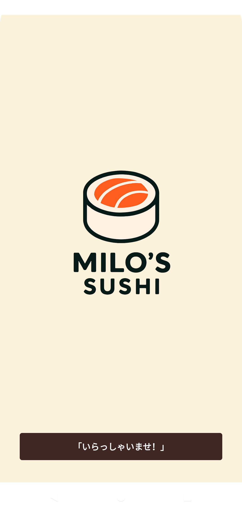
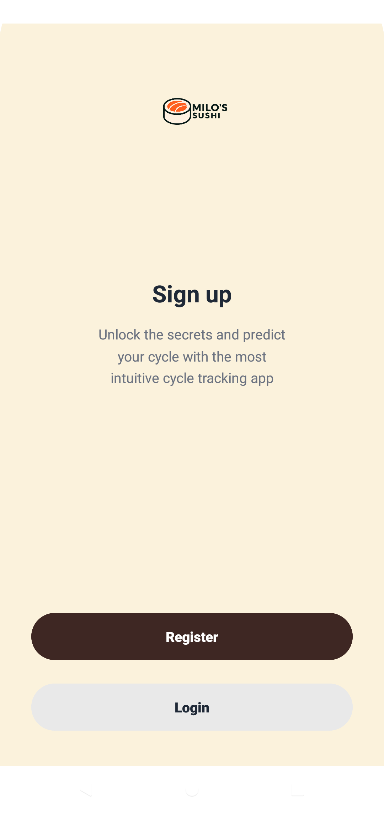
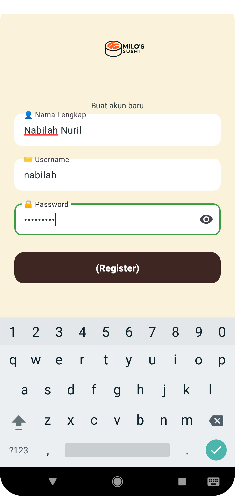
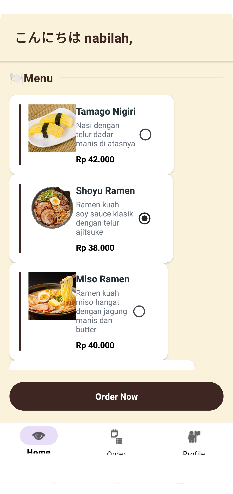
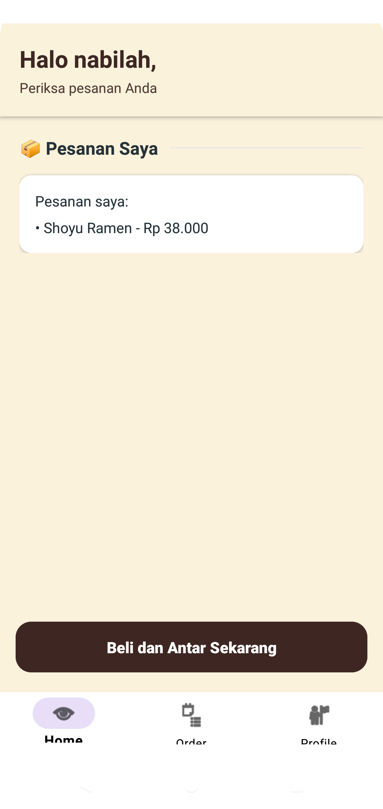
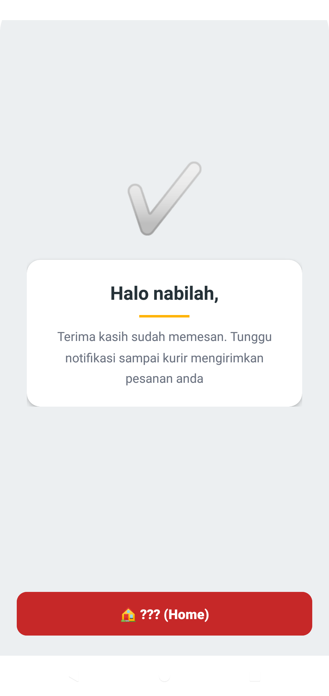

# 🍣 MILO SUSHI - Aplikasi Pemesanan Sushi

MILO SUSHI adalah aplikasi Android sederhana untuk memesan makanan sushi dan menu Jepang lainnya.  
Aplikasi ini dibuat menggunakan **Kotlin** dan **View Binding** sebagai bagian dari tugas Pemrograman Aplikasi Mobile.

---

## 📱 Tentang Aplikasi

**MILO SUSHI** membantu pengguna memilih menu makanan, melakukan pemesanan, mengisi alamat pengiriman, hingga mendapatkan konfirmasi pesanan.  
Aplikasi memiliki alur yang sederhana dan mudah dipahami oleh pengguna.

---

## ✨ Fitur Aplikasi

- ✅ Login dan Register pengguna
- ✅ Menampilkan daftar menu makanan
- ✅ Memilih satu menu makanan
- ✅ Konfirmasi pesanan
- ✅ Input alamat pengiriman
- ✅ Halaman selesai setelah pemesanan
- ✅ Tampilan sederhana dan user-friendly

---

## 📸 Screenshot Aplikasi

### 01. Splash Screen

Menampilkan logo **MILO SUSHI** sebagai halaman awal aplikasi.

---

### 02. Sign Up

Halaman awal autentikasi untuk memilih proses pendaftaran akun.

---

### 03. Login

Halaman login pengguna dengan input username dan password.

---

### 04. Register

Halaman pendaftaran akun baru dengan input data pengguna.

---

### 05. Home

Halaman utama yang menampilkan daftar menu makanan lengkap dengan:
- Gambar makanan
- Nama menu
- Deskripsi
- Harga
- RadioButton untuk memilih menu

---

### 06. Konfirmasi Pesanan

Menampilkan ringkasan menu yang dipilih sebelum melanjutkan ke alamat pengiriman.

---

### 07. Alamat Pemesanan

Halaman pengisian alamat pengiriman pesanan.

---

### 08. Selesai

Halaman akhir yang menandakan pesanan berhasil dilakukan.

---

## 🛠️ Teknologi yang Digunakan

- **Bahasa Pemrograman**: Kotlin
- **IDE**: Android Studio
- **UI**: XML Layout
- **Binding**: View Binding
- **Minimum SDK**: API 24

---

## 📁 Struktur Project

app/
├── java/com/example/praktikumwireframe/
│ ├── SplashActivity.kt
│ ├── LoginActivity.kt
│ ├── RegisterActivity.kt
│ ├── HomeActivity.kt
│ ├── OrderReviewActivity.kt
│ ├── AddressActivity.kt
│ ├── ConfirmActivity.kt
│ ├── FoodItem.kt
│ └── OrderData.kt
│
├── res/
│ ├── layout/
│ ├── drawable/
│ └── values/
│
└── AndroidManifest.xml

---

## alur
Splash Screen
      ↓
Sign Up / Login
      ↓
Home (Pilih Menu)
      ↓
Konfirmasi Pesanan
      ↓
Alamat Pemesanan
      ↓
Selesai

---

## 👩‍💻 Developer

Nama: Nabilah Nuril Zahra M. Karim
GitHub: https://github.com/naabilahkarim
Mata Kuliah: Pengembangan Aplikasi Mobile

📄 Status

✅ Aplikasi berhasil dijalankan
✅ Semua fitur berjalan dengan baik
✅ Screenshot terdokumentasi

© 2025 MILO SUSHI
